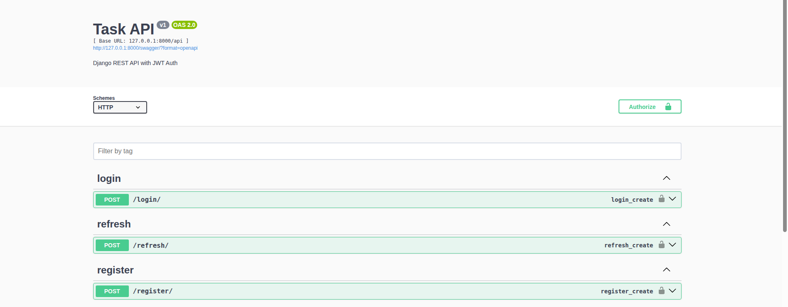
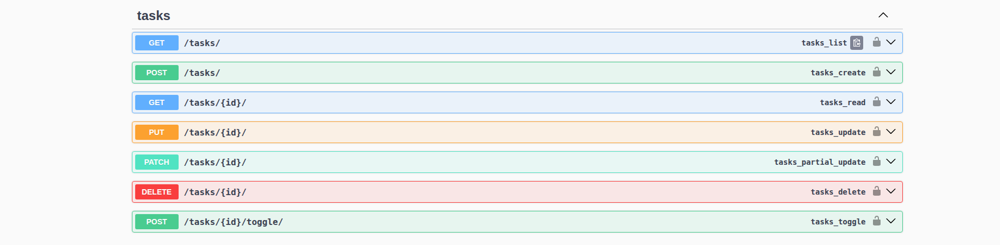
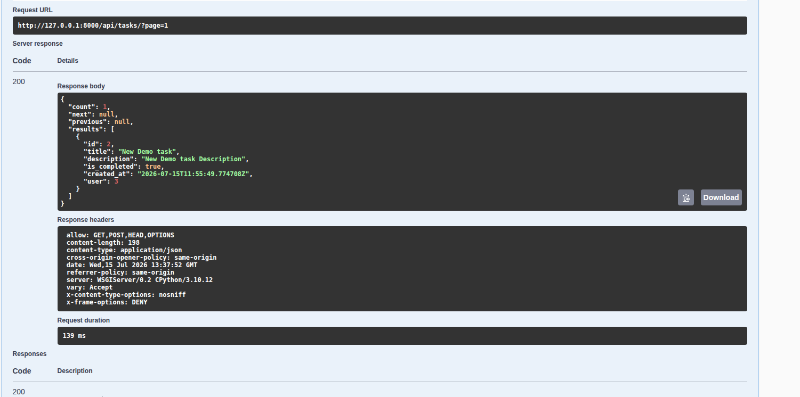
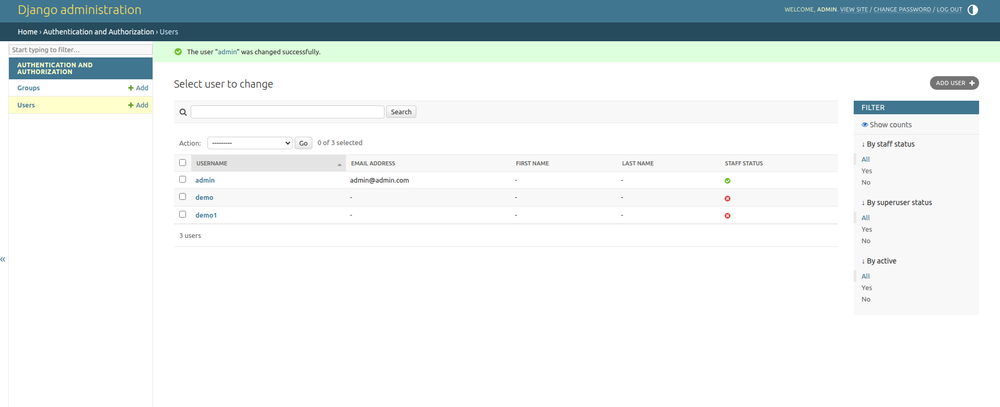

# Task Management API

A production-style Task Management REST API built with Django REST Framework.

This project demonstrates backend development practices including JWT authentication, Role-Based Access Control (RBAC), PostgreSQL integration, Swagger documentation, filtering, search, pagination, automated testing, and clean API design.

---

# Features
- Dockerized application for easy setup

## Authentication
- JWT Authentication using Simple JWT
- Secure API endpoints
- Token refresh support
- Password hashing using Django authentication system

## Role Based Access Control (RBAC)

### Admin
- View all tasks
- Manage all users' tasks
- Full access based on permissions

### User
- Create tasks
- View own tasks
- Update own tasks
- Delete own tasks

## Task Management
- Create tasks
- Update tasks
- Delete tasks
- View task details
- Mark task as completed
- Toggle task completion status

## API Features
- RESTful API design
- PostgreSQL database integration
- Filtering
- Search
- Pagination
- Swagger API documentation
- ReDoc API documentation

---

# Tech Stack
- Docker

## Backend
- Python 3.10+
- Django
- Django REST Framework

## Database
- PostgreSQL

## Authentication
- djangorestframework-simplejwt

## Documentation
- drf-yasg Swagger UI
- ReDoc

## Additional Packages
- django-filter
- python-dotenv

---

# Project Structure

task_api_project/

├── api/
│   ├── models.py
│   ├── serializers.py
│   ├── views.py
│   ├── permissions.py
│   ├── urls.py
│   └── tests/
│       ├── test_auth.py
│       ├── test_tasks.py
│       └── test_permissions.py
│
├── task_api_project/
│   ├── settings.py
│   ├── urls.py
│   ├── wsgi.py
│   └── asgi.py
│
├── manage.py
├── requirements.txt
├── README.md
├── .gitignore
└── .env.example

---

# Installation & Setup

1. Clone Repository
git clone https://github.com/nareshdash/task-management-api.git
cd task-management-api

2. Create Virtual Environment

Linux / Mac:
python3 -m venv venv
source venv/bin/activate

Windows:
python -m venv venv
venv\Scripts\activate

3. Install Dependencies
pip install -r requirements.txt

---

# Docker Setup

This project is fully containerized using Docker and Docker Compose.

## Run with Docker

1. Build and start containers:

docker compose up --build

2. Run database migrations:

docker compose exec web python manage.py migrate

3. Create superuser:

docker compose exec web python manage.py createsuperuser

4. Access the application:

API:
http://127.0.0.1:8000/

Swagger Docs:
http://127.0.0.1:8000/swagger/

ReDoc:
http://127.0.0.1:8000/redoc/

## Services

- web: Django application
- db: PostgreSQL database

## Notes

- PostgreSQL runs inside Docker container
- Django connects using DB_HOST=db
- No local database setup required

---

# PostgreSQL Database Setup

CREATE DATABASE taskdb;
CREATE USER taskuser WITH PASSWORD 'your_password';
GRANT ALL PRIVILEGES ON DATABASE taskdb TO taskuser;

---

# Environment Configuration

Create .env file:

SECRET_KEY=your_secret_key
DEBUG=True
DB_NAME=taskdb
DB_USER=taskuser
DB_PASSWORD=your_password
DB_HOST=localhost
DB_PORT=5432

---

# Database Migration

python manage.py makemigrations
python manage.py migrate

---

# Create Admin User

python manage.py createsuperuser

Admin Panel:
http://127.0.0.1:8000/admin/

---

# Run Development Server

python manage.py runserver

---

# API Documentation

Swagger:
http://127.0.0.1:8000/swagger/

ReDoc:
http://127.0.0.1:8000/redoc/

---

# Authentication

Register:
POST /api/register/

Login:
POST /api/login/

Refresh Token:
POST /api/refresh/

Use Token:
Authorization: Bearer <access_token>

---

# API Endpoints

Authentication:
POST /api/register/
POST /api/login/
POST /api/refresh/

Tasks:
GET /api/tasks/
POST /api/tasks/
GET /api/tasks/{id}/
PUT /api/tasks/{id}/
PATCH /api/tasks/{id}/
DELETE /api/tasks/{id}/
POST /api/tasks/{id}/toggle/

---

# Filtering

GET /api/tasks/?is_completed=true
GET /api/tasks/?is_completed=false

---

# Search

GET /api/tasks/?search=meeting

---

# Pagination

GET /api/tasks/?page=2

---

# Testing

python manage.py test

Example Output:
Ran 7 tests
OK

---

# Permission Logic

Admin:
- Can view all tasks
- Can manage all tasks

User:
- Can only access their own tasks

---

# Security Practices

- Environment-based secrets
- JWT authentication
- Role-based permissions
- Password hashing
- Protected endpoints

---

# Screenshots

---

# Future Improvements

- Production deployment setup
- Advanced filtering (priority, due date)
- Improved role management (admin dashboard)
- API rate limiting

---

# Author

Naresh Dash  
Backend Developer  
Python | Django | DRF | PostgreSQL